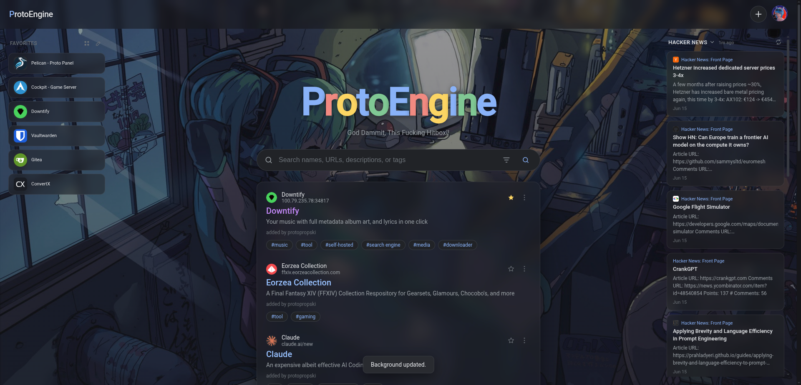
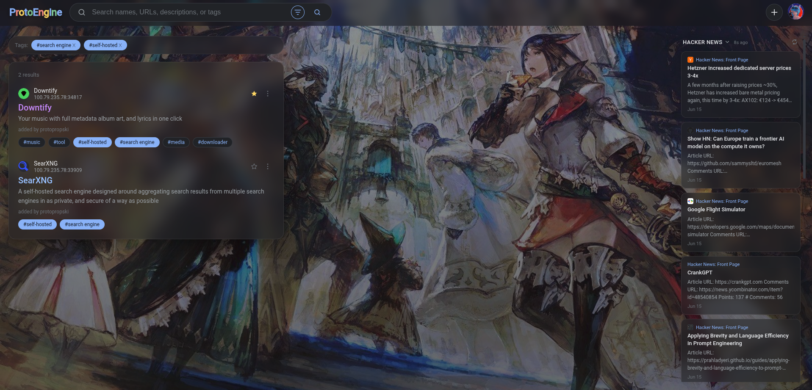
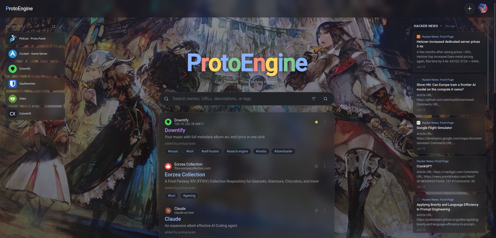
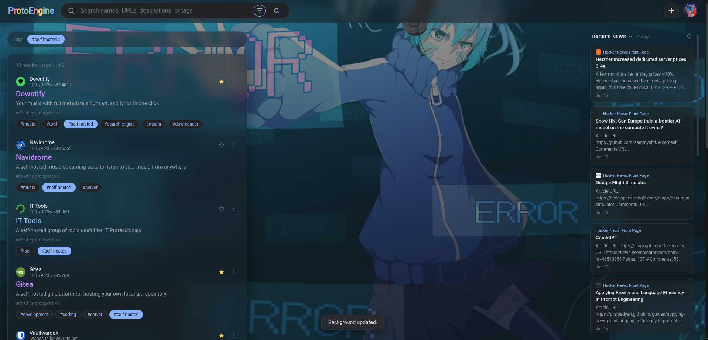

<div align="center">



*Index your bookmarks and find them again from one clean, customizable search page.*

</div>

---

## Screenshots

<div align="center">

| | |
|:-:|:-:|
|  |  |
|  |  |

</div>

---

## What it does

ProtoEngine is a self-hosted search page for the websites you and your group
actually use. Add links, tag them, and search across everything from one dark,
customizable page. It runs as a single container and keeps all its data in one
SQLite file, so there's nothing else to set up.

## Features

| | |
|---|---|
| 🔍 **Search** | Find sites by name, URL, description, or tag. Click a tag to filter. Sorting and autocomplete are built in. |
| 👥 **Accounts** | Register, log in, log out. The first account becomes the admin. There are three roles: User, Moderator, and Admin. |
| ➕ **Add sites** | A `+` button (when signed in) opens a form for the name, URL, description, tags, and a favicon. |
| 🧩 **ProtoEngine Assistant** | A Chrome extension (included in the repo) that saves the page you're on with one click. It fills in the title, URL, and favicon for you. |
| ⭐ **Favorites** | Pin sites to your own favorites panel. Reorder them by dragging, switch between grid and list view, and remove them in edit mode. Your layout is remembered. |
| 📰 **RSS feeds** | Add feeds and sort them into groups. Switch groups from the feed panel. Entries are pulled together and shown newest first. Supports RSS 2.0 and Atom. |
| 🎨 **Branding** | Admins can change the name, tab title, taglines, and pick from 15 title animations. No restart needed. |
| 🖼️ **Personalization** | Set your own profile picture and background. Results sit on a frosted-glass panel over your wallpaper. |
| 🔑 **API** | Each account can create a personal API key for adding or managing sites from scripts. |
| 🛡️ **Security** | Passwords are hashed. Sessions and forms are protected. Uploads are checked, and writes go through SQLite transactions. |
| 💾 **Backups** | Download a `.zip` of all your sites, taglines, and favicons, and restore it later. |

---

## Quick start

Run it locally:

```bash
npm install
cp .env.example .env        # edit .env and set the two secrets
npm start
```

Go to **http://localhost:3000** and register. The first account you make is the admin.

You need two secrets in `.env`. Generate one like this:

```bash
node -e "console.log(require('crypto').randomBytes(32).toString('hex'))"
```

Run it twice and use the results for `SESSION_SECRET` and `CSRF_SECRET`. If you
skip this, the app makes temporary ones and your logins reset every restart.

---

## Run with Docker

```bash
cp .env.example .env        # set SESSION_SECRET and CSRF_SECRET
docker compose -f compose.docker.yaml up -d --build
```

Then open **http://localhost:3000** and register.

These folders are mounted so your data survives a rebuild:

| Folder | What's in it |
|---|---|
| `./data` | the SQLite database and session files |
| `./public/icons` | uploaded favicons |
| `./public/avatars` | profile pictures |
| `./public/backgrounds` | background images |

The container runs as a normal user, not root. If it can't write to those
folders, set `PUID` and `PGID` in `.env` to your own user (run `id` to find
them), or take ownership of the folders once:

```bash
sudo chown -R $(id -u):$(id -g) ./data ./public/icons ./public/avatars ./public/backgrounds
```

To use it outside your home network, put it behind a reverse proxy with HTTPS,
keep `NODE_ENV=production`, and set `SECURE_COOKIES=true`. On plain HTTP, leave
`SECURE_COOKIES=false` or logins won't stick.

---

## Browser extension

The repo includes **ProtoEngine Assistant**, a Chrome extension that saves the
current page to your site in one click. It reads the page's title, URL, and
favicon, you add a description and tags, and it sends everything over using
your API key.

To install it:

1. Open `chrome://extensions` and turn on **Developer mode** (top right).
2. Click **Load unpacked** and pick the extension folder from the repo.
3. Open the extension and fill in two things:
   - **Base URL** - where your site runs, like `http://localhost:3000`.
   - **API key** - make one under **Settings → Developer** and paste it in.
4. Visit any site, click the icon, adjust the details, and hit **Add**.

Anything it adds belongs to your account. It works in Chrome, Edge, Brave, and
other Chromium browsers.

---

## Settings

All your settings live on one page with tabs down the side:

- **Account** - profile picture, username, password.
- **Customization** - your background image.
- **RSS** - your feeds, groups, and how often they refresh.
- **Developer** - your API key.
- **Admin Panel** - branding, users, listings, and backups (admins only).

### RSS feeds and groups

Add feed URLs under **Settings → RSS**, then make groups and drop any feed into
any group. On the feed panel, click the group name to switch between groups, or
pick **All Feeds** to see everything. Your choice is remembered. Feeds are
fetched on the server and can't be pointed at internal addresses.

---

## Configuration

Everything is set with environment variables in `.env`:

| Variable | Default | What it's for |
|---|---|---|
| `SESSION_SECRET` | *(required)* | Signs session cookies. Use 32+ random bytes. |
| `CSRF_SECRET` | *(required)* | Signs form tokens. Use 32+ random bytes. |
| `PORT` | `3000` | The port the app listens on. |
| `SECURE_COOKIES` | `false` | Set to `true` only when you're behind HTTPS. |
| `SQLITE_JOURNAL_MODE` | `DELETE` | Leave as is. Only use `WAL` on a local disk. |
| `PUID` / `PGID` | `1000` | The user the container writes files as. |

The name, tab title, taglines, and title animation are all set inside the app
on the **Admin → Branding** page, not here.

---

## API

Make an API key under **Settings → Developer**. You only see it once, so copy
it then. Send it as a Bearer token:

```bash
curl -H "Authorization: Bearer lmn_xxxx_yyyy" \
  https://your-host/api/sites?q=docs
```

A key acts as your account, with your permissions. Keys are stored hashed, and
you can revoke one any time (admins can revoke anyone's).

Main endpoints:

| Method | Endpoint | Notes |
|---|---|---|
| `GET` | `/api/sites` | search and list (public) |
| `POST` | `/api/sites` | add a site |
| `PATCH` / `DELETE` | `/api/sites/:id` | edit or remove a site |
| `GET` | `/api/config` | name, taglines, animation |

---

## Roles

| Role | What they can do |
|---|---|
| **User** | Manage their own sites and account, favorites, feeds, and API key. |
| **Moderator** | Everything a user can, plus edit or delete any site. |
| **Admin** | Everything, plus the Admin panel: users, roles, branding, and backups. |

The first person to register becomes the admin automatically.

---

## How it's built

```
server.js            the Express app: security, sessions, routing
data-store.js        the SQLite data layer
util.js              validation and cleanup helpers
middleware/auth.js   login and permission checks
routes/
  auth.js            register, login, account, favorites
  sites.js           list, search, add, edit, delete sites
  admin.js           users, roles, branding, backups
  rss.js             feeds, groups, entries
public/
  index.html         the page shell
  app.js             the whole frontend (plain JavaScript)
  styles.css         the dark theme
extension/           ProtoEngine Assistant (the Chrome add-on)
data/                the database and sessions (made at runtime)
```

Data lives in one SQLite file (`data/protoengine.db`). It's a real database
with tables and indexes, but it's still just a single file in your data folder
with no separate server to run.

---

## Troubleshooting

| Problem | Fix |
|---|---|
| Logins don't stick | On plain HTTP, set `SECURE_COOKIES=false`. Use `true` only with HTTPS. |
| Logins reset on restart | Set real values for `SESSION_SECRET` and `CSRF_SECRET`. |
| Can't write to `./data` | Set `PUID`/`PGID` to your user, or `chown` the folders. |
| Saving or importing hangs | Keep `SQLITE_JOURNAL_MODE` on `DELETE`. |
| First Docker build is slow | Normal. It builds the database module once. |
| Extension won't add pages | Check the Base URL and API key in its popup. |

---

<div align="center">

**ProtoEngine** · self-hosted search for the sites you actually use.

</div>
